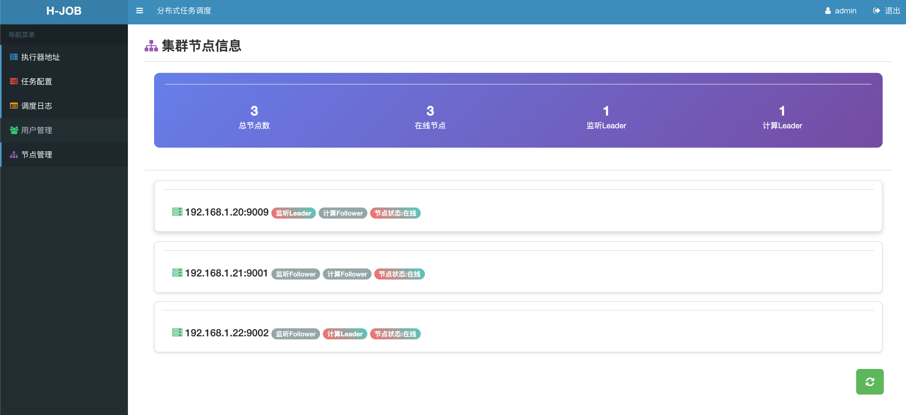

# H-Job 分布式任务调度系统

[](LICENSE)
[](https://www.oracle.com/java/)
[](https://spring.io/projects/spring-boot)

> 一个基于 Spring Boot + Vue 2 的轻量级分布式任务调度管理平台

## 📋 目录

- [开源许可](#开源许可)
- [项目特性](#项目特性)
- [技术栈](#技术栈)
- [项目结构](#项目结构)
- [快速开始](#快速开始)
- [访问地址](#访问地址)
- [功能模块](#功能模块)
- [配置说明](#配置说明)
- [开发指南](#开发指南)
- [贡献指南](#贡献指南)
- [联系我们](#联系我们)

## 📄 开源许可

本项目基于 **Apache License 2.0** 协议开源，详见 [LICENSE](LICENSE) 文件。

## ✨ 项目特性

- 🚀 **轻量易用** - 开箱即用，一键启动
- 🔧 **分布式调度** - 基于 Nacos 的服务发现与注册
- 📊 **可视化界面** - jQuery + Vue 2 构建的管理后台
- ⏰ **灵活调度** - 支持 Cron 表达式的任务配置
- 📝 **完整日志** - 详细的任务执行日志记录
- 🔐 **权限控制** - 用户管理与权限控制
- 📚 **API 文档** - 集成 Knife4j 在线接口文档

## 🛠️ 技术栈

### 后端技术
- **核心框架**: Spring Boot 2.7.18
- **数据持久**: MyBatis + MySQL
- **服务发现**: Nacos 2021.0.1
- **API 文档**: Knife4j
- **工具库**: Hutool 5.8.40
- **Java 版本**: JDK 1.8+

### 前端技术
- **基础库**: jQuery + Vue 2
- **UI 框架**: Bootstrap 3 + AdminLTE
- **表格组件**: jqGrid
- **弹窗组件**: Layer
- **构建方式**: 静态资源部署

## 📁 项目结构

```
h-job/
├── h-job-admin/                 # 后端管理模块
│   ├── src/main/
│   │   ├── java/                # Java 源代码
│   │   └── resources/           # 资源文件
│   │       ├── admin/        # 前端项目 (jQuery + Vue 2)
│   │       │   ├── css/         # 样式文件
│   │       │   ├── js/          # JavaScript 文件
│   │       │   ├── views/       # 页面文件 (HTML)
│   │       │   ├── libs/        # 第三方库
│   │       │   └── plugins/     # 插件
│   │       ├── mybatis-mapper/  # MyBatis 映射文件
│   │       └── application.properties  # 应用配置
│   ├── start.sh                 # 启动脚本
│   └── stop.sh                  # 停止脚本
├── h-job-common/                # 公共模块
├── sql/                         # 数据库脚本
│   └── init.sql                 # 初始化SQL
├── LICENSE                      # Apache License 2.0
├── pom.xml                      # Maven 配置
├── README.md                    # 项目说明
├── start.sh                     # 全局启动脚本
└── stop.sh                      # 全局停止脚本
```

## 🚀 快速开始

### 环境要求

- JDK 1.8+
- Maven 3.6+
- MySQL 5.7+
- Nacos 2.x

### 安装步骤

#### 1️⃣ 克隆项目

```bash
git clone <repository-url>
cd h-job
```

#### 2️⃣ 初始化数据库

```bash
# 导入初始化SQL
mysql -u root -p < sql/init.sql

# 验证数据表是否创建成功
mysql -u root -p -e "USE h-job; SHOW TABLES;"
```

#### 3️⃣ 配置数据库

修改 `h-job-admin/src/main/resources/application.properties`：

```properties
spring.datasource.url=jdbc:mysql://localhost:3306/h-job?useUnicode=true&characterEncoding=utf8&useSSL=true&serverTimezone=GMT%2B8
spring.datasource.username=your_username
spring.datasource.password=your_password
```

#### 4️⃣ 启动应用

**方式一：使用启动脚本**
```bash
cd h-job-admin
chmod +x start.sh stop.sh
./start.sh
```

**方式二：Maven 打包运行**
```bash
cd h-job-admin
mvn clean package -Dmaven.test.skip=true
java -jar target/h-job-admin-1.0.0.jar
```

#### 5️⃣ 验证启动

查看启动日志：
```bash
tail -f h-job-admin/logs/startup.log
```

## 🌐 访问地址

| 功能 | 地址 | 说明 |
|------|------|------|
| **登录页面** | http://127.0.0.1:9009/h-job/admin/views/login.html | 用户登录 |
| **API 文档** | http://localhost:9009/h-job/doc.html | Swagger 接口文档 |

### 默认账户

- **用户名**: admin
- **密码**: 123456

> ⚠️ **安全提醒**: 生产环境请及时修改默认密码！

## ⚙️ 功能模块

### 1. 服务地址管理
- 支持 Nacos 自动服务注册发现
- 手动录入服务地址
- 服务状态监控

### 2. 任务配置管理  
- 可视化任务配置界面
- 支持 Cron 表达式
- 任务启停控制
- 任务参数配置

### 3. 调度日志管理
- 实时任务执行日志
- 执行状态统计
- 失败重试机制
- 日志详情查看

### 4. 用户管理
- 用户账号管理
- 角色权限分配
- 操作日志审计

## ⚙️ 配置说明

### 应用配置

主要配置文件：`h-job-admin/src/main/resources/application.properties`

## 👥 开发指南

### 前端开发

前端项目位置：`h-job-admin/src/main/resources/admin/`

**特点**：
- 纯静态资源，无需构建工具
- 直接修改文件即可生效
- 与后端一体化部署

**示例(截图)**
  
### 后端开发

### 代码规范

- 遵循阿里巴巴 Java 开发手册
- 方法注释覆盖率 > 80%
- 提交前必须通过所有单元测试

## 🤝 贡献指南

我们欢迎任何形式的贡献！

### 提交流程

1. Fork 本仓库
2. 创建特性分支 (`git checkout -b feature/AmazingFeature`)
3. 提交更改 (`git commit -m 'Add some AmazingFeature'`)
4. 推送到分支 (`git push origin feature/AmazingFeature`)
5. 开启 Pull Request

### 开发规范

- 提交信息格式：`[类型] 简短描述`
  - `feat`: 新功能
  - `fix`: 修复bug
  - `docs`: 文档更新
  - `style`: 代码格式调整
  - `refactor`: 重构代码
  - `test`: 添加测试

## 📞 联系我们

- **作者**: H
- **邮箱**: bp_hanye@126.com
- **项目地址**: [https://github.com/syyehan/h-job](https://github.com/syyehan/h-job)

## 🙏 致谢

感谢以下开源项目：
- [Spring Boot](https://spring.io/projects/spring-boot)
- [Vue.js](https://vuejs.org/)
- [Nacos](https://nacos.io/)
- [AdminLTE](https://adminlte.io/)
- [jqGrid](https://github.com/tonytomov/jqGrid)

---

⭐ 如果这个项目对您有帮助，请给我们一个 Star！
